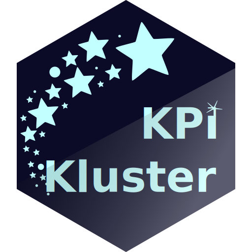

<!-- README.md is generated from README.Rmd. Please edit that file -->

# KPi Kluster 

<!-- badges: start -->

<!-- badges: end -->

[KPi Kluster](https://js-rapps.shinyapps.io/KPi_Kluster/) is a small app
that provides a large database of (Key) Performance Indicators (KPI).
These KPIs come from many different fields like online retail, user
experience, accounting, IT, transportation and many more.

If you are looking for KPIs in the “vicinity” of user experiences (UX)
and human-centered design (HCD) you may use the link
<https://js-rapps.shinyapps.io/KPi_Kluster/?_inputs_&set=%22ux%22>. It
will limit narrow the set down to everything related to digital
products, internet business including research-related KPIs.

## How To Search

The app has 2 search modes: standard mode and the reg-ex mode (regular
expressions).

### Standard Mode

Specify your search terms similar similar to a file search on your
system.

- Space characters separate search terms. Multiple spaces are ignored.
- The order of search terms is ignored. Searching “mobile app” is
  identical to “app mobile”.
- By default KPi Kluster will search for **all given search terms**. If
  an entry does not match them all, it will be ignored. You can change
  the setting to tell the search that it is okay to find **any of the
  search terms**.
- You can also decide whether the search shall be case sensitive or not.
  Be default it is not.
- The different search items are logically combined like this:
  `free text AND (domains OR tags)`.

**Wild cards** are placeholders that make your search more powerful. You
can use the wild cards `?` and `*`.

- `?` is a placeholder that represents any single character.
- `*` represents one or more characters.
- That implies that you cannot search for ? or \* characters. They are
  always placeholders.

### Reg-Ex Mode

If you have not heard about regular expression before, just ignore this
for now. Regular expressions are very powerful. But they are also rather
complicated. They are not easy to learn. If you are familiar with them,
you are welcome to use them KPi Kluster implements a [Perl-like style of
regular
expressions](https://search.r-project.org/R/refmans/base/html/regex.html).

## Origins

Some of the KPIs in the “kluster” (almost 100) are provided by me (the
author Jan Seifert) collected from various sources like books and
professional experience. These KPIs are taken from my the professional
field I am active in, and that includes among others **e-business,
digital product management and user experience**.

Some of the KPIs have been gathered from the [KPI
library](http://www.kpilibrary.com/). For almost 10 years the KPI
Library offered professionals a platform to share, search, and discuss
KPIs. The collection now available for download is the result of a
community effort. The platform behind it was the KPI Library. It was
founded in 2007 by Mirror42. Mirror42 was acquired by ServiceNow in July
2013.

These data were extensively improved by the author. Over 2500 KPIs were
eliminated or merged.

- Removal of duplicate indicators,
- Removal of indicators not complete enough to be understandable
- Spelling correction
- Removal of “lonely” tags that existed only once for clarity
- Combination of redundancies between KPIs for clarity
- Correction of empty fields

Despite all these efforts the library may still contain ambiguities,
vagueness, and mistakes. It was not possible so far to fill all missing
information.

Please note that you use KPi Kluster at your own responsibility.

## Working with KPIs

Looking up KPIs in a data base means that the function you want to
improve has become a ‘hygiene factor’ of your business. You cannot excel
in this area over your competitors. You cannot win anything by improving
it … but you will lose if you don’t.

If you - however - need to track something to compete over, you need to
find ways to differentiate yourself from your competitors. Which means:
you need to differentiate your KPIs. Because - in general - if two
organisations measure the same thing, they will end up doing the same
thing.

If you want to find ways to be different, you can use a KPI data base as
inspiration. But you will track and work your KPIs in very different
ways.

If you have never worked intensively with numbers and KPIs, I can only
recommend that you get some help. If you e.g. have never heard the terms
‘spurious correlation’ or ‘scale level’, I can only recommend that you
get some help.

## Mentions

I am a [Changitor](https://www.changitors.com/en)! That means that you
and I together are driving change - digitally, in an agile and
people-centered manner. Though the Kluster is my own private project, I
probably would never have done this without the inspiration in the
[Changitor team](https://www.changitors.com/en).

Thank you also to [ServiceNow](https://www.servicenow.com) for hosting
the [KPI library](http://www.kpilibrary.com/) for many years.

Another thank you to [UID GmbH](https://www.uid.com).
